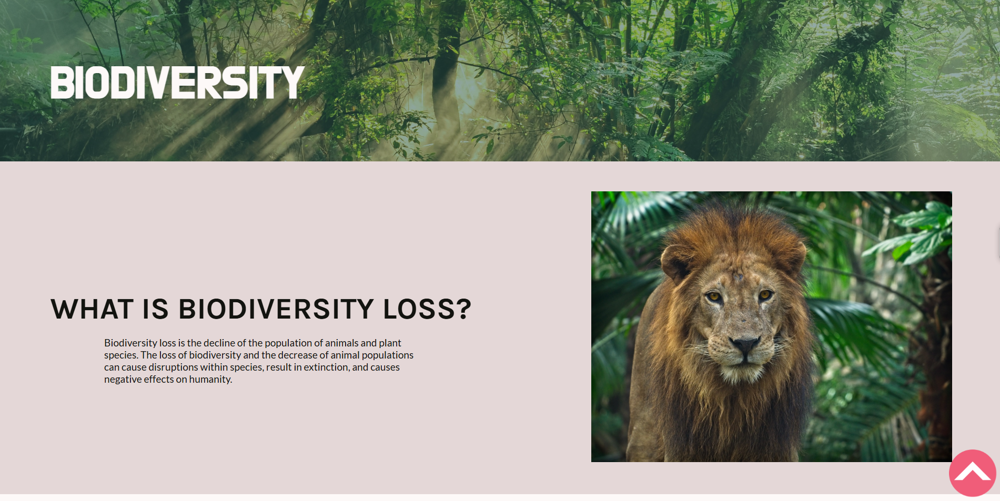

# 🌿 **Biodiversity Awareness Site**

A visually engaging and interactive educational website that highlights the global issue of biodiversity loss. Developed as a school project, this site aims to inform users about the causes and consequences of biodiversity decline, propose actionable solutions, and showcase endangered species from different environments around the world.

---

## 🌏 About the Project
### This website was created to:

- Educate users about the causes of biodiversity loss

- Highlight endangered species from various regions

- Provide real-world solutions individuals and communities can take

- Inspire action through powerful visuals and interactive content

### 💡 Features

- Informative sections on biodiversity threats and solutions

- Galleries featuring endangered animals, with images and information

- Engaging visuals and interactive elements

- Responsive layout for different screen sizes

---

## 🎥 Preview
Click image for preview video:
### 

---

### 🛠️ Tech Stack

HTML – for page structure

CSS – for styling and layout

JavaScript (minimal) – for simple interactivity (e.g. toggles, transitions)

---

## 🚀 Run Locally

Clone the repo

git clone https://github.com/your-username/biodiversity-site.git

Open index.html in your browser

## 📚 Credits

All sources and images credited in-site.
